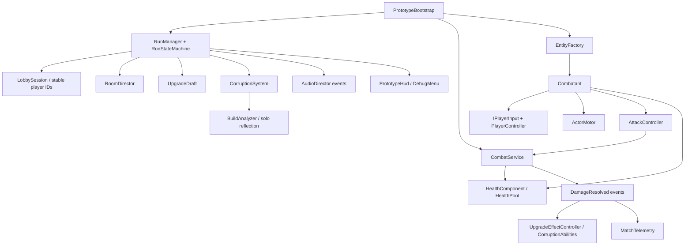
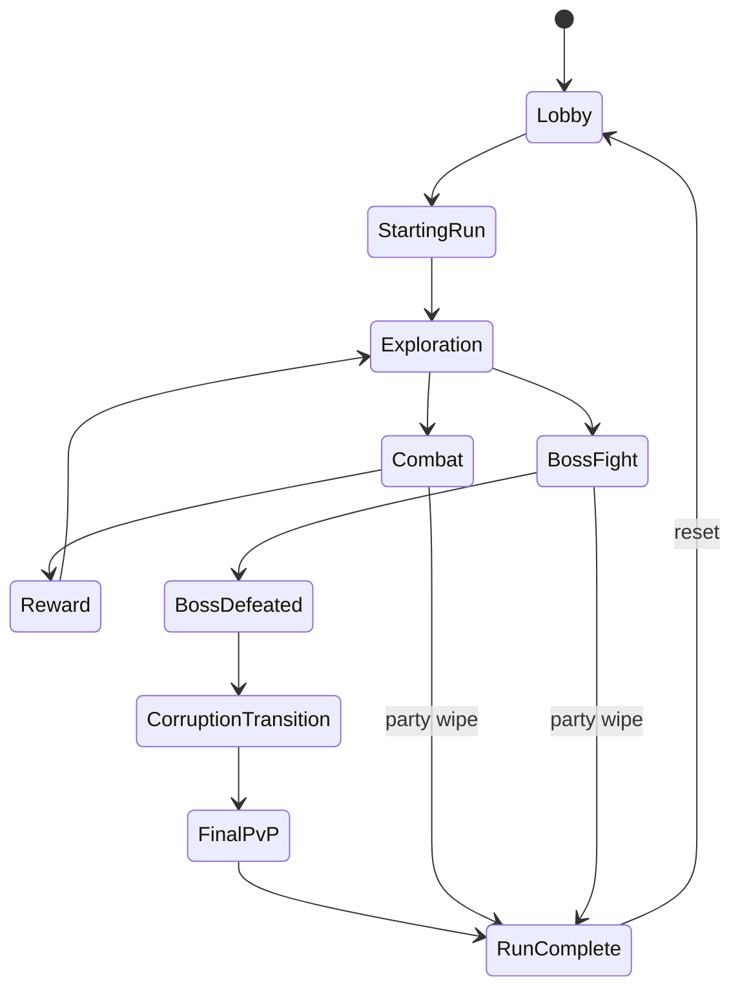

# Architecture and important scripts

This developer document contains the final-encounter design. The lobby and early controls intentionally do not reveal it.

## Composition and authority

`PrototypeBootstrap` is the composition root, not a gameplay manager. It supplies explicit references to each service. There is no global player singleton. Every combatant has an entity ID; human players keep their lobby IDs (`P1`–`P4`). Items belong to each combatant's `PlayerInventory`.

The three assemblies are:

- **Ashbound.Domain:** plain C#, no Unity references. State transitions, damage permissions, health arithmetic, roster rules, corruption selection, and build analysis.
- **Ashbound.Runtime:** Unity controllers, presentation, data objects, and service wiring. Depends on the domain and Input System.
- **Ashbound.Editor:** repeatable asset/scene creation and Windows builds. Never enters player builds.

Gameplay commands enter through `IPlayerInput → PlayerCommand → PlayerController`. A future network adapter can replace the input implementation while an authoritative host retains `CombatService`, `RunManager`, item ownership, and RNG. This prototype uses seeded local RNG but is **not deterministic lockstep simulation**.

## Run flow

Each regular room has two waves, each with a reward. After the last reward, the gate unlocks. Only a nearby player interaction travels to the next room. The two-second boss-death pause precedes a 1.6-second corruption transition. Physics/combat pauses during reward, transitions, and menus. Movement alone is allowed in Exploration.

`RunStateMachine` rejects corruption from every state except BossDefeated and requires the boss-death latch before FinalPvP. Debug boss skipping is a separately named operation; it does not mark the boss defeated. Normal friendly fire stays off. Damage requires the appropriate run state even if an attack or status retains a reference to its source.

## Combat pipeline

1. A weapon, projectile, ability, status, or hazard creates `DamageInfo` with source identity, kind, amount, direction, stun, knockback, and explicit crit/proc permissions.
2. `CombatService` checks pause/state and `CombatRules` team permissions.
3. Source stats, optional crit, and contextual vulnerability are applied.
4. `HealthPool` rejects invalid/negative damage and invulnerable hits, absorbs shields first, and clamps health.
5. Health death/changed events, motor impact, and `DamageResolved` notify interested systems.
6. Only marked weapon hits trigger relic and on-hit corruption effects. Secondary damage never recursively triggers those effects.

`StatusEffectController` stores stacks per kind and source, refreshes durations, and ticks bleed/burning once a second. Slow and stun share the same reusable application path. Bosses ignore stun. Damage over time retains the original source for team checks and telemetry. Room/reward/phase boundaries clear pending projectiles, areas, and statuses.

Dash is 0.22 seconds at speed 22, with 0.15 seconds of invulnerability and a 1.15-second cooldown. Player hit stun is capped at 0.15 seconds. The common active ability has a seven-second cooldown, grants 20 shield, and deals a radial hit with knockback. Shields cap at half maximum health and absorb until consumed or the actor is restored.

## Data and upgrades

`ItemDefinition` includes ID, display name, description, rarity, tags, stat modifiers, triggered effects, optional on-hit statuses, and an optional prerequisite. Each relic is unique per actor. Drafts shuffle eligible relics without replacement and offer up to three; exhausted debug inventories are safely skipped.

`WeaponDefinition` keeps weapon family independent from elemental tags and adds Common through Legendary rarity, on-hit status data, descriptive identity, and an optional `WeaponSkillDefinition`. The generic skill executor supports dash melee, radial burst, projectile volley, persistent zone, and gravity-well delivery without weapon-specific controller classes.

`PlayerEquipment` owns one Head, Chest, Gloves, and Boots entry. `ArmorDefinition` carries element/build tags, modifiers, and a lightweight passive. Pieces reference `ArmorSetDefinition`; the equipment component groups equipped pieces by set and activates both the two-piece and four-piece tiers when their thresholds are reached. Stats, effects, passive powers, build analysis, telemetry, and debug UI query the equipment component rather than duplicating set state.

| Relic | Main behavior |
|---|---|
| Glass Sigil | +17% critical chance |
| Echo Edge | Critical weapon hits release a small damage echo |
| Quicksilver Oath | Critical hits reduce active ability cooldown |
| Thorn Rune | Weapon hits apply stacking bleed |
| Bloodglass | Damage bonus against bleeding targets; +5% crit |
| Red Benediction | Four bleed stacks explode and heal the attacker |
| Storm Coil | Every fourth landed weapon hit chains lightning |
| Forked Heart | More lightning targets; critical hits add charge; requires Storm Coil |

Base crit is 8%, critical multiplier is 1.7. Bleed and secondary effect damage use the source damage multiplier. Multiple enemies hit by a melee swing count as separate landed weapon hits for lightning. The coil chain can hit each target at most once per discharge. Forked Heart is excluded from choices until the owner has Storm Coil.

## Boss, corruption, and solo

`CinderRegentController` cycles a telegraphed projectile fan, marked area blast, and a marked lunge. Below 40% health it accelerates attacks and adds area threats. Its identity and tuning live in `BossDefinition`, which references `BossCorruptionProfile`.

After boss death, all players are restored for the final encounter. Two/three players produce one corrupted player. Four players produce one or two, configurable in the catalog/debug menu. `CorruptionSelector` samples unique IDs; forced debug IDs still respect the allowed count and must belong to the locked roster. All surviving/dead roster members are eligible. Team allies remain protected; only opposing teams damage each other by default.

`CorruptionAbilities` applies the boss profile separately from `PlayerController`: health/damage/movement multipliers, burning on weapon hits, a burning dash trail, a fire-burst override, and a violet silhouette/crown/ring. The profile has a VFX prefab hook and thematic tags. Extending beyond the prototype's ash abilities calls for another behavior component/profile interpreter, not more conditionals inside the player controller.

Solo never creates an AI ally. `BuildAnalyzer` counts relic, weapon, element, Weapon Skill, armor, and active-set tags, ranks up to three readable themes, and resolves stable ties by enum order. `CorruptionSystem` copies the player's weapon, including element and skill, then maps the analyzed themes to at most four representative relics. It applies ash corruption afterward, so the boss profile layers over the copied elemental build. It does not clone every equipment effect or arbitrary item state.

## Script map

| Folder / important script | Responsibility |
|---|---|
| `Core/PrototypeBootstrap` | Scene service composition |
| `Core/Combatant`, `EntityFactory` | Entity identity, component aggregation, primitive spawning |
| `Core/Domain/*` | Engine-independent rules and calculations |
| `Player/ActorMotor` | CharacterController movement, dash, knockback, hit stun |
| `Player/AttackController` | Melee cone and active ability execution |
| `Multiplayer/LocalPlayerInput` | Keyboard/mouse, second keyboard, device-specific gamepads |
| `Combat/CombatService` | Central authoritative damage and faction filtering |
| `Combat/HealthComponent`, `StatusEffectController` | Health lifecycle and source-aware statuses |
| `Combat/CombatProjectile`, `AreaAttack` | Swept projectiles and telegraphed/lasting area damage |
| `Enemies/EnemyDefinition`, `EnemyBrain`, `EnemyRoleBehaviour` | Data-driven enemy identity plus ten separated role strategies |
| `Enemies/EnemyElementRuntime`, `RegionEnemyPoolDefinition` | Element mechanics layered over roles and future region ecology pools |
| `Bosses/CinderRegentController` | Boss patterns and health phase |
| `Roguelike/UpgradeDraft`, `UpgradeEffectController` | Choice lifecycle and proc interpretation |
| `Items/*Definition`, `PlayerInventory`, `PlayerEquipment`, `WeaponSkillExecutor` | Relic/weapon/skill/armor data, ownership, set evaluation, and skill delivery |
| `Rooms/EncounterDefinition`, `CombatSpaceDefinition`, `RoomDirector`, `RoomView` | Composed encounters, irregular connected graybox spaces, seals, and spawning |
| `Routes/*Definition`, `ExpeditionRouteRuntime`, `RouteNodeSessions` | Seeded graph topology, visibility/voting, node services, and regional Boss rewards |
| `Run/RunManager` | Run orchestration, checkpoints, final outcome, reset |
| `Corruption/*`, `Solo/ReflectionController` | Boss modifiers, roster selection, solo final opponent |
| `UI/PrototypeHud`, `Debug/DebugMenu` | Play/lobby UI and gated test controls |
| `UI/CombatVfx`, `ActorView`, `Player/ArenaCamera` | Placeholder presentation |
| `Audio/AudioDirector` | Optional clip slots and public audio cue events |
| `Data/MatchTelemetry`, `UnlockData`, `LoreEntry` | Local JSON, unlock schema, story data |
| `Editor/PrototypeContentBuilder` | Missing-content creation and development builds |

## Audio and progression seams

Audio cues cover exploration/combat/boss music, boss death, music fade, silence, corruption cue, final music, and run completion. No soundtrack is bundled. Assign clips on an AudioDirector or subscribe to its `Cue` event for an audio middleware integration. The boss-death path fades out over 0.7 seconds before silence and the next cue.

`UnlockData` contains only content/cosmetic IDs; there are no persistent stat multipliers. `LoreEntry` and room/boss descriptions are ScriptableObjects. Collected fragments remain in the current run journal; persistent lore collection is deferred.

## Extension limits

No networking library is installed. Stable IDs, input abstraction, events, and central damage authority make future host validation possible, but prediction, reconciliation, snapshots, identity authentication, reconnect mapping, and synchronized RNG/physics are unimplemented. Never expose direct client authority over item grants, boss death, or faction selection when adding a transport.

## v0.4 profile, Hub, and expedition economy

`MetaProgressionProfile` is versioned, host-owned persistent data. It stores currencies, facilities, unlock pools, preparations, discoveries, bosses, and lifetime statistics. It never stores live combatants, health, current relics, run weapons, armor, or corruption state. `MetaProgressionStore` writes an atomic JSON file below `Application.persistentDataPath/Profile`, migrates older valid profiles through normalization, and moves invalid data aside before creating safe defaults. Profile ID and run player entity ID remain independent.

`MetaProgressionService` is the runtime boundary between the profile and an expedition. Its `RunResources` wallet is recreated at launch, receives encounter/salvage rewards, and settles into the persistent wallet only on outcome. `ProgressionEconomy` owns retention, salvage, and merchant-price invariants. `HubFacilityDefinition`, `PreparationDefinition`, and `ProgressionTuningDefinition` keep costs, unlocks, caps, future node targets, reward quality, and Rest/Temper hooks in ScriptableObjects.

The existing MainMenu lobby is now the functional Hub. It exposes the Expedition Table, Forge, Quartermaster, Infirmary, Archive, and Research Station without creating a second input authority or replacing the local roster. `EquipmentRewardDraft` runs after the relic draft, queues each combatant independently, filters the profile's unlocked pools, applies modest rarity/element weights, and lets that player equip, leave, or dismantle. Equipment remains on the combatant and disappears with the run.

## v0.6 route graph and node identity

The route graph is an abstract progression layer over the playable world. `ExpeditionRouteRuntime` chooses one of three validated graph variants from the run seed, exposes only information permitted by route-reveal score, and requires every local roster member to vote before resolving multiplayer choices. It never constructs combat geometry. `RoomDirector.LoadNode` continues to build the node's assigned v0.5 irregular `CombatSpaceDefinition`, including transition paths and distant extension hooks.

Node services are short-lived runtime sessions. Treasure, Merchant, Rest, and Event sessions own their own costs and completion rules. Combat nodes return through the same encounter, enemy-brain, and space pipeline as v0.5. The graph Boss is explicitly regional; only the separate final-area gate changes the state machine to `BossFight`, preserving the corruption security boundary.

Reward cadence is authored per node. Normal Combat does not automatically open either draft. Hard and Elite can request equipment at distinct quality floors; Relic owns relic selection; Treasure owns targeted/costed equipment; Merchant spends the run wallet; Rest owns recovery/Temper; and the Boss uses `BossRewardDefinition`.
